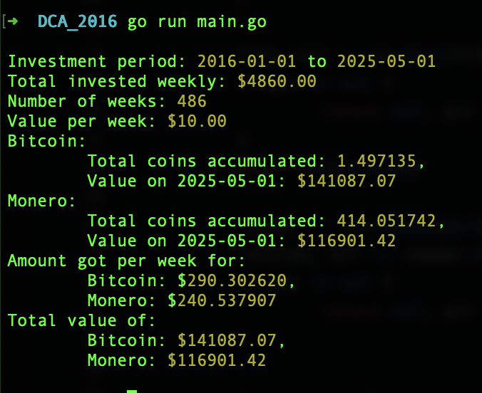

# DCA_2016

A friend told me XMR was not as performant as BTC, I checked how much I wanted to check I could have gain from it compared to BTC. 

So I used my package of price fetching from CSV build in satsukashii ( check my gitub ) https://github.com/afa7789/satsukashii

Basically I get the prices of both in the time series and after that I check how much we would buy with 10 dollars every friday from 2016 to now.



## Usage

```bash
    go run main.go
```
